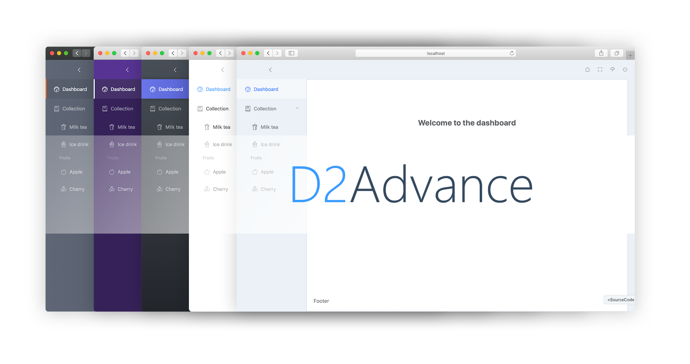

<h1 align="center"><font color="#409eff">D2</font><font color="#35495e">Advance</font></h1>
<p align="center">Advance, convention first, colourful front-end practice. be inspired by D2Admin :)</p>
<p align="center">
  <a
    ></a>
  <a href="https://github.com/d2-projects/d2-advance/blob/master/LICENSE">
    
  </a>
  <a
    ></a>
  <a href="https://github.com/d2-projects/d2-advance" target="_blank">
    
  </a>
  <a
    ></a>
  <a
    ></a>
</p>
<p align="center">
  
</p>

## Quick start

Clone quickly, without history commit.

``` sh
git clone --depth=1 https://github.com/d2-projects/d2-advance
```

Install dependencies, and run dev server.

``` sh
yarn install
yarn serve
```

Or use npm.

``` sh
npm install
npm run serve
```

Open http://localhost:8080/ in browser when you see that:
```
 DONE  Compiled successfully in 6782ms                                                                                                                                       10:43:40 PM

 
  App running at:
  - Local:   http://localhost:8080/ 
  - Network: http://192.168.23.33:8080/

  Note that the development build is not optimized.
  To create a production build, run yarn build.
```

### Compiles and minifies for production
``` sh
yarn run build
```

### Compiles and minifies for preview
``` sh
yarn run build:preview
```

### Run your tests
``` sh
yarn run test:unit
```

### Lints and fixes files
``` sh
yarn run lint
```

### Customize configuration
See [Configuration Reference](https://cli.vuejs.org/config/).
