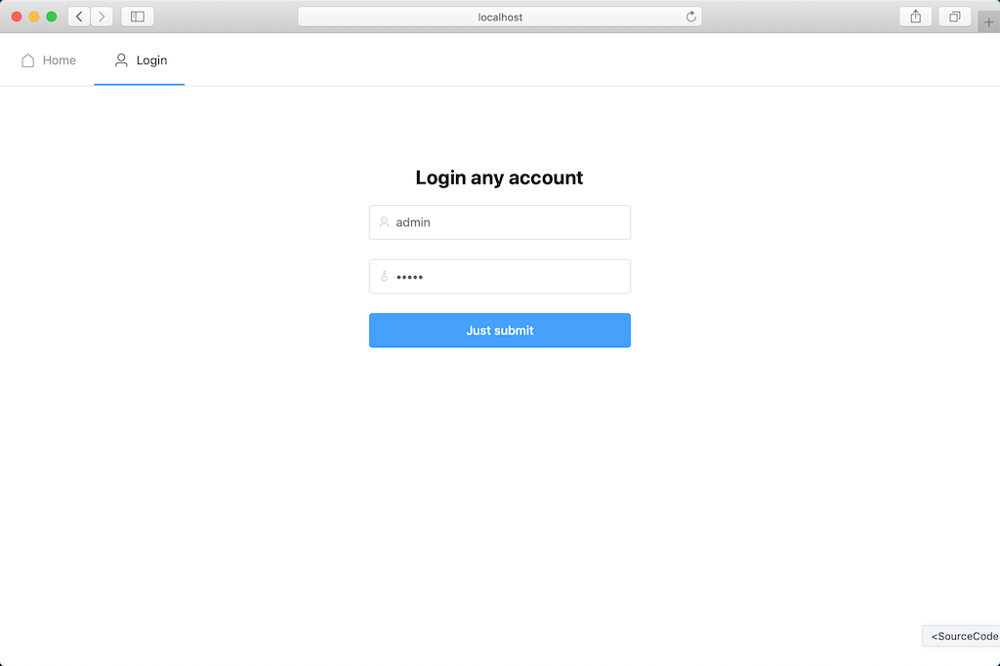
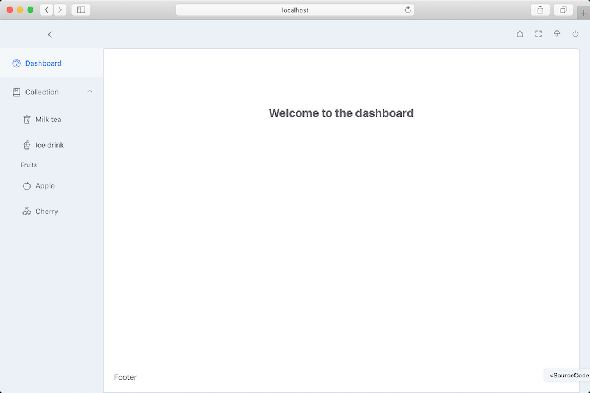
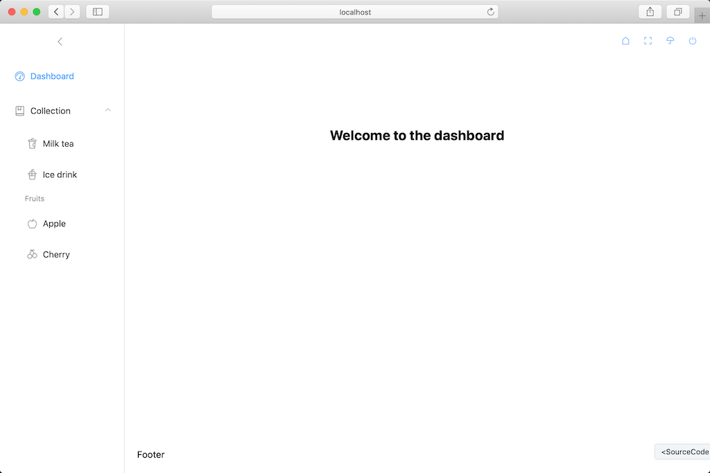
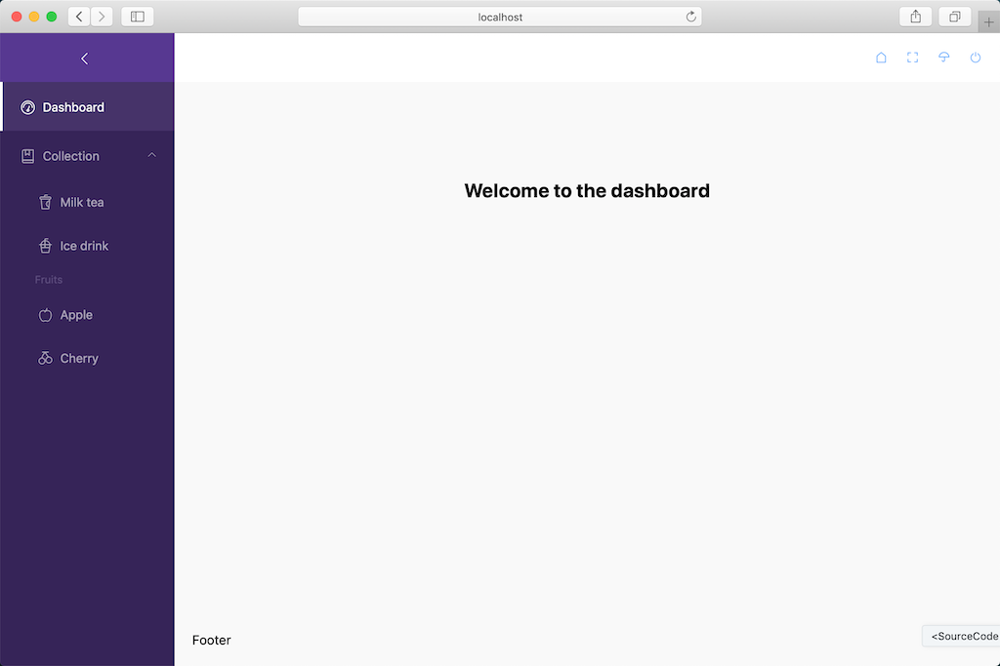
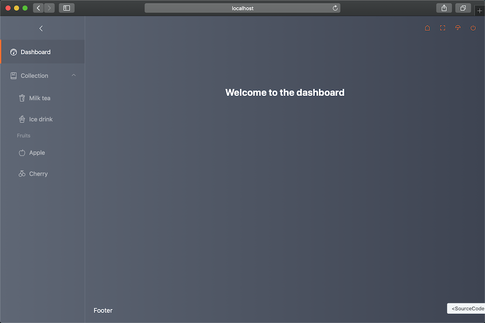

<h1 style="text-align: center"><span style="color: #409eff">D2</span><span style="color: #35495e">Advance</span></h1>
<p style="text-align: center">Advance, convention first, colourful front-end practice. be inspired by D2Admin :)</p>

<p style="text-align: center">
  
  
  
  
  
  
</p>

## Features

- ✔️ Build with vue-cli3
- ✔️ Use ElementUI
- ✔️ Router rule engine
- ✔️ User login
- ✔️ Source code viewer
- ✔️ Theme construct
- more...

## Project setup
```
yarn install
```

### Compiles and hot-reloads for development
```
yarn run serve
```

### Compiles and minifies for production
```
yarn run build
```

### Compiles and minifies for preview
```
yarn run build:preview
```

### Run your tests
```
yarn run test
```

### Lints and fixes files
```
yarn run lint
```

### Customize configuration
See [Configuration Reference](https://cli.vuejs.org/config/).
